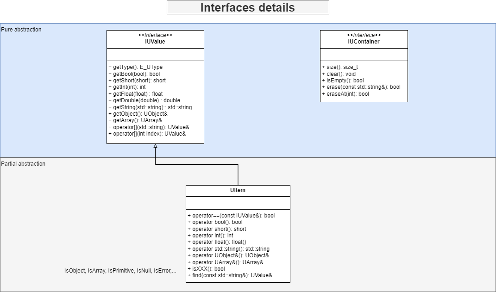

# Introduction
This is a IO helper library library created for a project that couldn' use a more recent version than VS2013. Based on standard library it uses c++ 11.
It uses the standard library but was created to be used as a dll in Windows environment.
The purpose of this project is to have an intuitive object abstraction that allows reflexion to be able to create different serializers. The core library, developed in modern c++ defines inspectable objects that doesn't throw exception and optimizes memory usage.
A first implementation use json serialization.
# Installation
<u><b>Note:</b></u> The library was developped for a windows usage but has no other dependency to windows library than `__declspec` defined in ``JsonIO.h``.
1. Compile UIO project that will produce UIO.lib and UIO.dll
1. In your c++ project, ensure to include all required header files:
    - IUContainer.h
    - IUSerializable.h
    - IUValue.h
    - UArray.h
    - UObject.h
    - UPrimitive.h
    - UIO_All.h
    - UIO.h
    - JsonIOHelper.h
    - UItem.h
    - UValue.h
    - UUndefined.h
    - JsonSerializer.h
    - JsonReader.h
    - JsonWriter.h
1. In your c++ project, ensure to link to ``UIO.lib``
1. In your c++ code, just include `UIO_All.h` file that includes all you need. You might want to use namespace json to simplify the code
1. At runtime, your application will need ``UIO.dll``

# Usage
The interface `IUSerializable` is dedicated to define `readObject` and `writeObject` method which is implemented by the model classes to map each property to a common object: `UObject` which is a dictionary mapping keys to `UValue` object.
A `UValue` can be one of `UArray`, `UObject` or a `UPrimitive` which supports boolean, short, int, float, double, std::string and const char* primitives.
## IJsonSerializable
```cpp
#include "UIO_All.h"

using namespace uio;


class Item : public IUSerializable
{
public:
    Item() {}
    Item(const std::string& name, int id) : m_name(name), m_id(id) {}
    void toObject(UObject& object) const override
    {
        object["name"] = m_name;
        object["id"] = m_id;
    }
    void fromObject(const UObject& object) override
    {
        m_name = object["name"].getString("default");
        m_id = object["id"].getInt(-1);
    }
    std::string getName() const { return m_name; }
    int getId() const { return m_id; }
private:
    std::string m_name;
    int m_id{ 0 };
};

class Items : public IUSerializable
{
public:
    Items()
    {
    }
    void toObject(UObject& object) const override
    {
        UArray l_devices;
        for (auto& d : m_items)
        {
            UObject o;
            d.toObject(o);
            l_devices.push_back(o);
        }
        object["devices"] = l_devices;
    }

    void fromObject(const UObject& object) override
    {
        m_items.clear();
        const UArray& items = object["devices"].getArray();
        for (const auto& v : items)
        {
            const UObject& o = v.getObject();
            Item it;
            it.fromObject(o);
            add(it);
        }
    }

    void add(const Item& d)
    {
        m_items.push_back(d);
    }
    void add(Item&& d)
    {
        m_items.push_back(d);
    }
    Item& operator[](int index)
    {
        return m_items[index];
    }
    std::string to_string()
    {
		return JsonSerializer::serialize(*this, false);
    }
private:
    std::vector<Item> m_items;
};


int main()
{
    Items d;
    d.add({ "device_1", 1 });
    d.add({ "device_2" , 2 });
    JsonSerializer::serialize(std::cout, d, true);
    Items d2;
    std::string djson = JsonSerializer::serialize(d, false);
    JsonSerializer::deserialize(djson, d2);
    d2.add({ "device_3", 3 });
    std::cout << d2.to_string() << std::endl;
    std::cout << "items[1]: " << d2[1].getName() << std::endl;

    // Expected results
    /*
    {
        "devices":
        [
            {
               "id": 1,
               "name": "device_1"
            },
            {
                "id": 2,
                "name": "device_2"
            }
        ]
    }
    {"devices": [{"id": 1, "name": "device_1"}, {"id": 2, "name": "device_2"}, {"id": 3, "name": "device_3"}]}
    items[1]: device_2
    */

}

```

## JsonObject
A `UObject` can be initialized with a json string or filled using operator []; The type of JsonValue is inferred from the primitive type or can be a `UObject` or a `UArray`.
Note that a copy is used when adding an object or an array. They should be filled to be added to the parent object.
A `UObject` can be written to or read from a string or a stream.
If one tries to access an index that does not exist or find a property that does not exist, a reference to an Undefined value is returned which will always return the default value. This is to avoid controls at runtime.
getInt on an object or an array will return the size of the object (number of properties) or array (number of items).

<u><b>Note:</b></u>The Undefined value will be in an error state and cannot be assigned. If you try to set a JsonValue in another object or array, the new value will be an Undefined value.

An object property can be accessed using an index but user should be aware that the index order depends on the alphabetical order of properties.
An array item can be accessed with a string if it can be parsed as a valid index of the array.

```cpp
#include "UIO_All.h"
#include <iostream>

using namespace uio;


int main()
{
    UObject o;
    o["isOk"] = true;
    o["value"] = 3500;
	o["item"] = E_UType::Object;
	JsonSerializer::deserialize(R"({"id": 1, "name": "item"})", o["item"].getArray());
    o["price"] = 35.78;
    UArray a;
    UArray a2{ 10, "20", o["item"], nullptr };
    for (int i = 1; i < 4; i++)
    {
        a << UObject{ {"id", i} };
    }
    o["ids"] = a;
    o["values"] = a2;
    std::cout << o.getString() << std::endl;
    JsonSerializer::serialize(std::cout, o, true);
    std::cout << "ids[0]: " << o["ids"][0].getString() << std::endl;
	std::cout << "o[0][\"0\"]: ";
	JsonSerializer::serialize(std::cout, o[0]["0"]);
	std::cout << std::endl;
    std::cout << "isOk: " << (std::string)o["isOk"] << std::endl;
    std::cout << "values: " << o["values"].getString() << std::endl;
    std::cout << "values[1]: " << (int)o["values"][1] << std::endl;
    std::cout << "ids[2].id: " << o.find("ids[2].id").getInt() << std::endl;
    std::cout << "price: " << o["price"].getDouble() << std::endl;
    std::cout << "test default: " << o.find("path.does.not.exist").getString("not found") << std::endl;

    // Expected results
    /*

		Object{ids: Array, isOk: Bool, item: Object, price: Double, value: Int, values: Array}
		{
			"ids":
			[
				{
				"id": 1
				},
				{
				"id": 2
				},
				{
				"id": 3
				}
			],
			"isOk": true,
			"item": {},
			"price": 35.78,
			"value": 3500,
			"values":
			[
				10,
				"20",
				{},
				null
			]
		}
		ids[0]: Object{id: Int}
		o[0]["0"]: {"id": 1}
		isOk: true
		values: Array[4]
		values[1]: 20
		ids[2].id: 3
		price: 35.78
		test default: not found
    */
}

```

# Architecture

Your code will use ``UValue`` instances or reference to contain any primitive, a ``UObject`` or a ``UArray``.
You have too keep in mind that a ``UValue`` contains a unique pointer to any ``IUValue``. Affecting a ``UObject`` or a ``UArray`` to a ``UValue`` copy the content to that value even if you pass a reference.
When you set a ``UValue`` to any other type than ``UObject`` or ``UArray`` it will be stored as a ``UPrimitive<T>`` of the object.
The ``UPrimitive<T>`` describes specializations for the following types:
- bool
- short
- int
- float
- double
- const char*
- std::string
- nullptr_t

Here bellow the availables methods on core interfaces:



Here is an exemple of serialization architecture with Json serializaztion:


